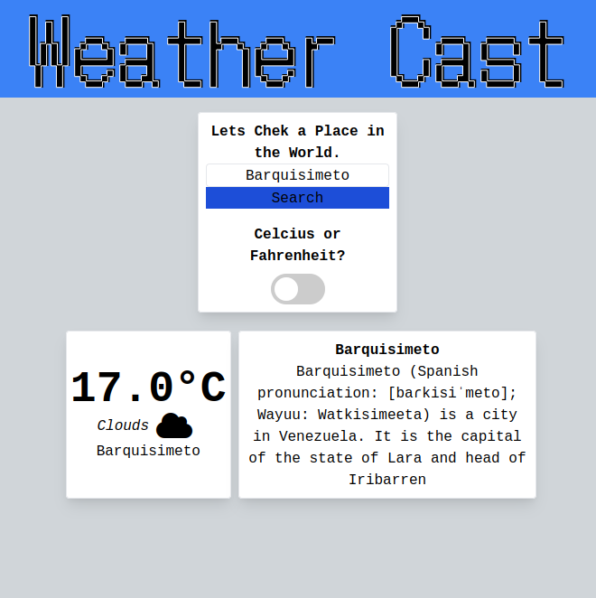

# Weather-Cast

A simple page to check the Weather in any city, that also gives you the description from a Wikipedia article of the place.


## Built With

- HTML
- CSS
- Tailwind
- Javascript

## Live Demo



[Live Version](https://rawcdn.githack.com/SigmaSam/Weather-Cast/2351a964e79a07a7b043c75b0e97ba31dd75bbe1/dist/index.html)

## Getting Started

To get a local copy up and running follow these simple example steps.

### Setup

- Clone this repository. Type `git clone https://github.com/SigmaSam/Weather-Cast.git`
- Navigate to the project folder (Weather-Cast) `cd Weather-Cast`
- run `npm install` to get all packages needed for the app then run `npm run build`.
- Open the `index.html` with the browser `double click on index.html` if you want to see the app running.

### Run tests

```
npx eslint .
```

## Authors

Feel free to reach out. We are always happy to connect :slightly_smiling_face:

👤 **Samuel Almao**

[<code></code>](https://github.com/SigmaSam)
[<code></code>](https://twitter.com/DungeonSam)
[<code></code>](https://www.linkedin.com/in/samuel-almao/)
[<code></code>](mailto:samuelalmaoherrera@gmail.com)

​


## 🤝 Contributing

Contributions, issues and feature requests are welcome!

Feel free to check the <a href="https://github.com/SigmaSam/Weather-Cast/issues"> issues page</a>.

## Show your support

Give a ⭐️ if you like this project!
